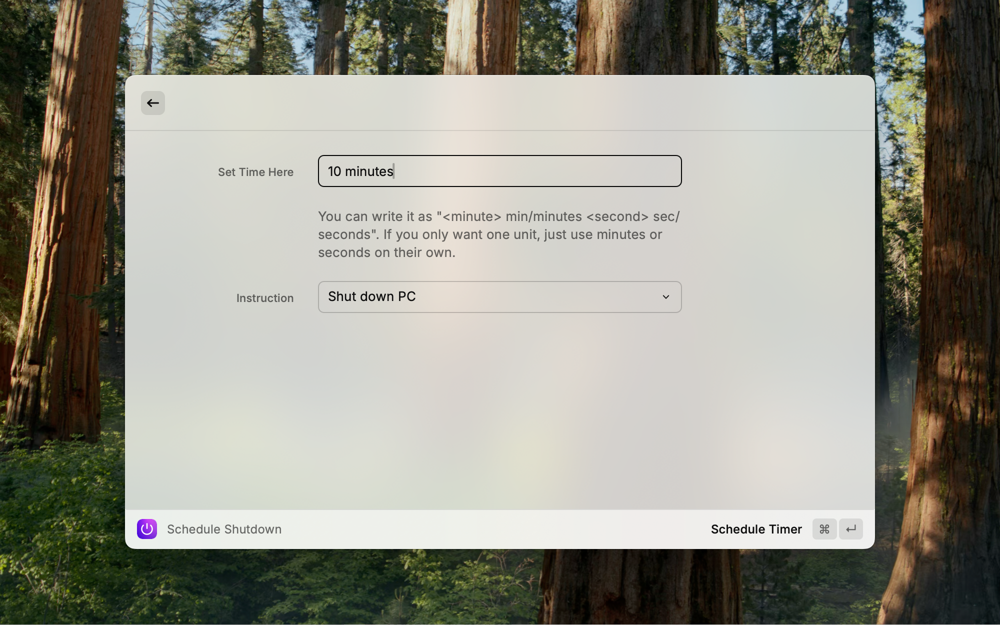

# Shutdown Timer for Raycast

A Raycast extension that allows users to schedule a timed shutdown for their system, ensuring running tasks can be completed before powering down. I made this for myself because I wanted a simple tool that would automatically shutdown my computer after a period of time. I wanted to simplify scheduling shutdowns so that I didn't need to have an extra terminal window to manage it



## Features

- Set a custom timer for shutdown (minutes or hours) up to 15 hours
- View remaining time before shutdown in real time
- Works seamlessly within Raycast with live updates


## Usage

1. Schedule the shutdown using **Schedule Shutdown**

2. Fill out the timer details
`
<hour> hours <minute> minutes <second> seconds
`

- Shorthand _h_, _min_ or _sec_ for units
- Mix and match different units for exact time control

3. See remaining time using **Remaining Time**

4. Cancel Shutdown using **Stop Shutdown**

## Functionality
To schedule the shutdown, the extension will execute an AppleScript to the Finder application and store the process id in Raycast Local Storage. When the user cancels the shutdown, it uses the process id and kills the process running 


## Getting Started

### Prerequisites
- Install the [Raycast app](https://www.raycast.com).
    - Currently Raycast is only available on Mac, with a waitlist on the Windows Beta
- Install Node.js.
    - The minimum version recommended is v20.18.1. If you're using an older version, you may encounter issues.

### Running Development

1. Clone the Repo     
```
git clone https://github.com/WhosMadeer/shutdown-raycast.git
```

2. Install required packages

```
npm install
```

3. Run Raycast Project

```
npm run dev
```
- Raycast will automatically open up with the extension loaded


## Contributing

Pull requests are welcome! For major changes, please open an issue first to discuss potential modifications.

## License

This project is licensed under the MIT License. See the LICENSE file for details.

Enjoy a controlled and hassle-free shutdown experience with Raycast!
